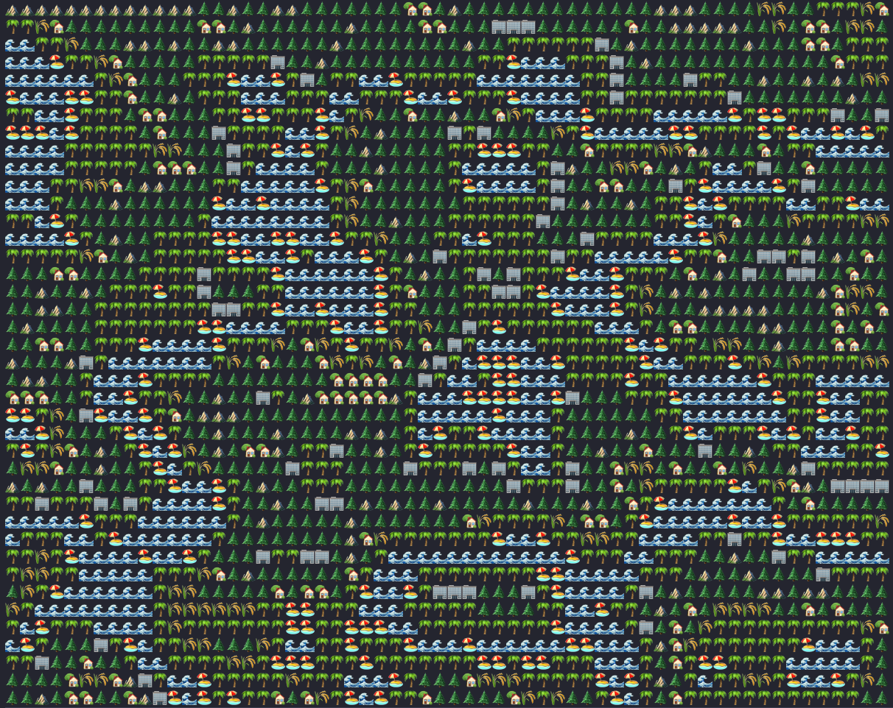

# emojination

EmojiNation is an enchanting Python project that brings emoji magic to life! 🪄✨ Generate immersive lands using the power of emojis, creating a colorful and expressive world that's as unique as your imagination. 🏞️🌈 Dive into a realm where code transforms into vibrant landscapes of your own design, turning simple symbols into captivating scenery. 🖥️💡 Explore the art of code, one emoji at a time! 🚀🐍 

##
``` sh
git clone git@github.com:mobamoh/emojination.git
cd emojination
python3 andscape_generator.py
```
## Demo


## Author
Mo bamoh